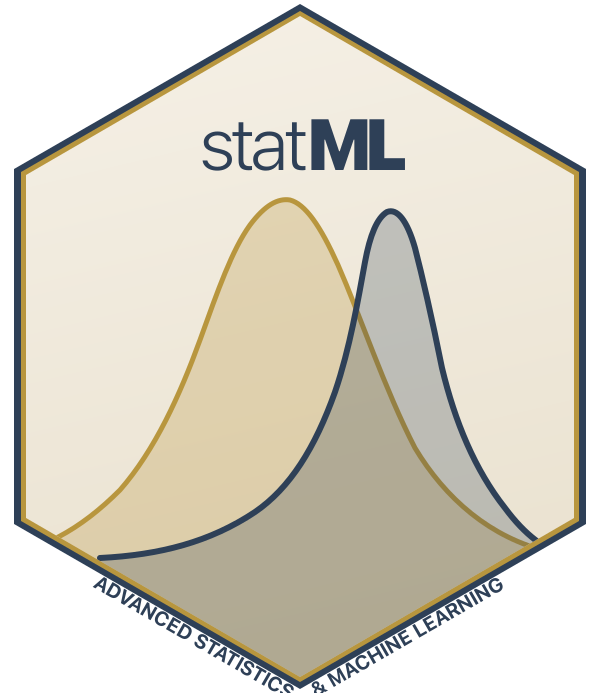

<p align="center">
  
</p>

<h1 align="center">Advanced Statistics and Machine Learning<br/>for Health Research</h1>

<p align="center">
  <em>A practical course for health researchers</em><br/><br/>
  <a href="https://mark-khurana.github.io/ML_and_Stats_Course/"><strong>Read the book online</strong></a><br/><br/>
  
  
  
</p>

---

## What this course covers

| Part | Topics |
|------|--------|
| **Pre-Course** | Probability, inference, regression foundations |
| **Advanced Statistics** | Splines, penalised regression, survival analysis |
| **Bayesian Methods** | Bayesian inference, hierarchical models |
| **Dimensionality Reduction** | PCA, t-SNE, UMAP, clustering |
| **Machine Learning** | Trees, ensembles, deep learning, model evaluation |
| **Clinical Prediction Models** | Development, validation, reporting (TRIPOD+AI) |
| **Advanced Toolkit** | Causal inference, meta-analysis, journal-ready analysis |

## Who it is for

Researchers who know basic statistics (means, t-tests, maybe some regression) and want to learn the methods they see in current medical journals: splines, penalised regression, prediction models, Bayesian analysis, gradient boosting, and deep learning.

Everything uses clinical data. Every exercise works in **R** and **Python**. Pick one or try both.

## Key features

- Bilingual R/Python code throughout
- Clinical examples in every chapter
- Exercises with starter code
- Current references (2024--2026) from BMJ, JAMA, Lancet, Nature Medicine
- TRIPOD+AI reporting guidance
- Journal-ready analysis capstone

## Citation

If you use this course in your teaching or research, please cite:

```bibtex
@online{statML2026,
  title = {Advanced Statistics and Machine Learning for Health Research},
  year = {2026},
  url = {https://mark-khurana.github.io/ML_and_Stats_Course/},
  note = {Online course, CC BY 4.0}
}
```

## Running locally

```bash
# Requires Quarto (>= 1.7), R, and the packages listed in R/setup.R
quarto render
```

## Key sources

- Smits, van Kuijk & Wynants, *Improving Health Care with Clinical Prediction Models* (2026)
- Van Calster et al., *Lancet Digital Health* (2025) -- performance measures
- Lopez-Ayala et al., *BMJ* (2025) -- continuous variables and splines
- Collins et al., *BMJ* (2024) -- TRIPOD+AI reporting guidelines
- Harrell, *Regression Modeling Strategies* (2015)
- McElreath, *Statistical Rethinking* (2020)

## Licence

[Creative Commons Attribution 4.0](https://creativecommons.org/licenses/by/4.0/). Use it, adapt it, share it -- just give credit.
